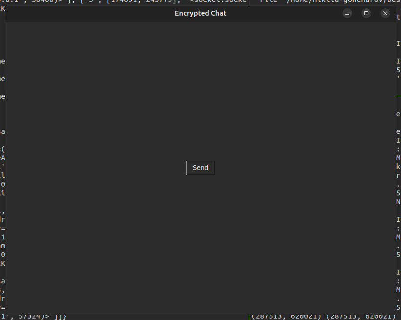
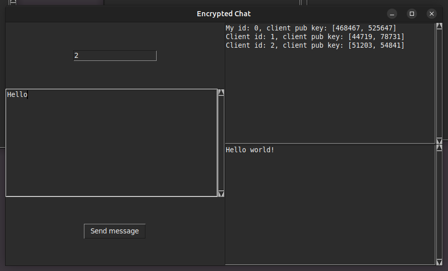
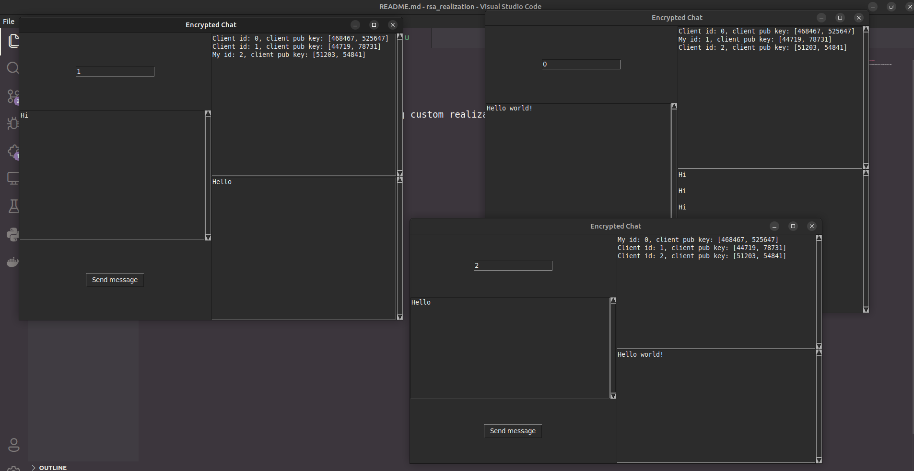

# Client-server socket messenger

---

Messages between clients are encrypted using custom realization RSA.

### First window for sharing your public key:



### In second window you already can write anonymous messages:



### Also you can open few windows with chat:



## Setup

!Program working with built-in libraries

For start server:

```bash
$ cd project_dir
$ python server.py
```

For open client window:

```bash
$ cd project_dir
$ python client.py
```
